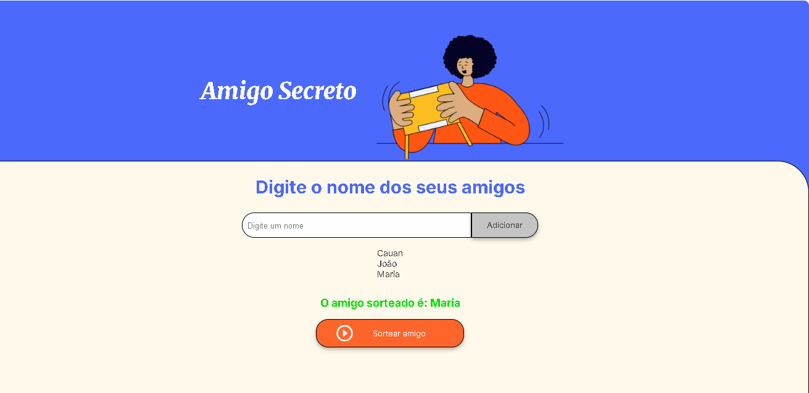

# README - Aplicação Amigo Secreto

A aplicação permite organizar o jogo de "Amigo Secreto". Com ela, você pode adicionar amigos, visualizar a lista de amigos adicionados e sortear um amigo aleatoriamente.

## Como Usar

1. Digite um nome no campo de entrada e clique em "Adicionar".
2. Depois, clique em "Sortear amigo" para revelar o nome sorteado.

## Estrutura de Arquivos

- `index.html` - A página principal.
- `style.css` - O arquivo de estilo.
- `app.js` - Lógica JavaScript da aplicação.

## Como Executar

1. Abra o arquivo `index.html` no seu navegador.
2. Ou abra o link a seguir: [Aplicação Amigo Secreto](https://thiagosantosreis.github.io/Challenge-Amigo-Secreto/).

## Conclusão

Agora você pode usar a aplicação para organizar facilmente seu jogo de "Amigo Secreto"!

---

Desenvolvido por **Thiago Santos**

    

        
Desenvolvido por <strong>Thiago Santos</strong>

    

</body>
</html>
